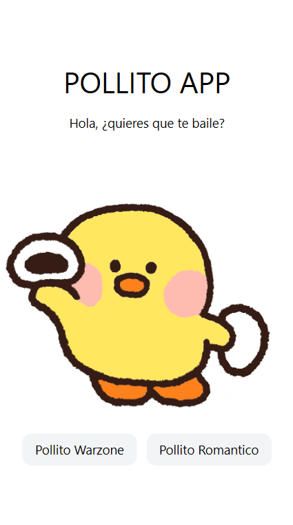
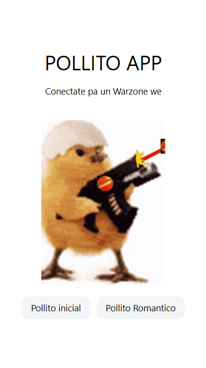
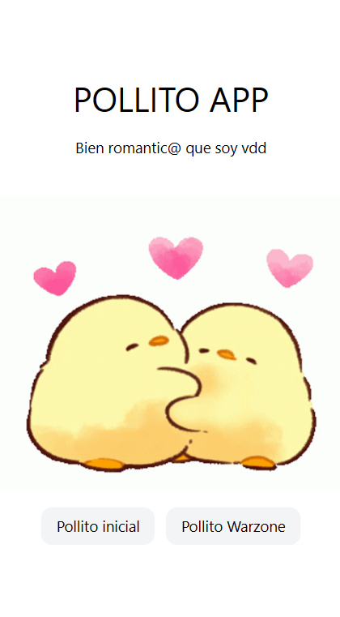

# Ejemplo de Despliegue en Netlify

Este es un ejemplo práctico presentado en un video de TikTok que te guía en el proceso de desplegar una aplicación front-end en Netlify.

Puedes ver la aplicación desplegada en el siguiente enlace:

[Visitar Aplicación](https://pollito-netlify.netlify.app/)

## Vista Previa

